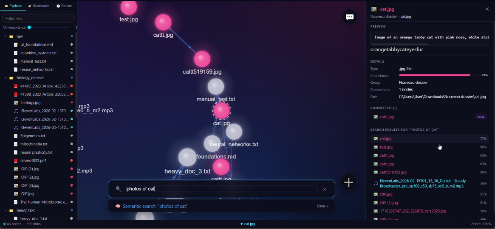

# Memoir — Multimodal RAG Knowledge System

> **SMU AI MINDS Hackathon**

Memoir is a modular **Retrieval-Augmented Generation (RAG)** system with graph-augmented search, real-time file watching, and a constellation-graph UI for exploring your knowledge base.

---

## Architecture

```
/
├── backend/          # FastAPI RAG engine + ingestion pipeline
├── file_handling/    # File-watching server (local + cloud polling)
└── ui/               # Vite/React constellation-graph frontend
```

```
User drops a file  ─►  file_handling (port 8080)
                              │
                    POST /api/ingest
                              │
                        backend (port 8000)
                    ┌─────────┴──────────┐
                  Qdrant             PostgreSQL
                (vectors)           (metadata)
                              │
                           Redis
                        (conversation)
                              │
                         Ollama LLM
                              │
                    ◄── RAG answer ──►  ui (port 5173)
```

---

## Quick Start

### 1. Start infrastructure (Docker)

```bash
cd backend
docker compose up -d
```

Starts **Qdrant** (`:6333`), **PostgreSQL** (`:5432`), and **Redis** (`:6379`).

### 2. Pull the LLM

```bash
ollama pull llama3.2
```

### 3. Start the backend API

```bash
cd backend
pip install -r requirements.txt
cp .env.example .env   # fill in your values
uvicorn app.main:app --reload --host 0.0.0.0 --port 8000
```

API docs → **http://localhost:8000/docs**

### 4. Start the file-watching server

```bash
cd file_handling
pip install -r requirements.txt
cp .env.example .env   # fill in GOOGLE_API_KEY etc.
python run_server.py --port 8080
```

### 5. Start the frontend

```bash
cd ui
npm install
cp .env.example .env
npm run dev
```

Frontend → **http://localhost:5173**

<p align="center">
  
</p>

---

## Detailed Documentation

| Component | README | Additional Docs |
|-----------|--------|-----------------|
| Backend (FastAPI RAG) | [backend/README.md](backend/README.md) | [Relevance Verification](backend/docs/RELEVANCE_VERIFICATION.md) |
| File Handling Server | [file_handling/README.md](file_handling/README.md) | [File Watching Guide](file_handling/docs/FILE_WATCHING.md) · [Drive Integration](file_handling/docs/DRIVE_LINK_INTEGRATION.md) |
| Frontend (React) | [ui/README.md](ui/README.md) | [Integration Guide](ui/docs/INTEGRATION.md) · [Chat Debugging](ui/docs/CHAT_DEBUGGING.md) |

---

## Key Features

- **Graph-augmented retrieval** — `score = α·semantic + β·centrality + γ·recency + δ·importance`
- **Multimodal ingestion** — PDF, Word, images (VLM captioning), audio (Whisper), CSV, JSON
- **Cloud file watching** — Monitor Google Drive & OneDrive folders; auto-ingest on change
- **Conversation memory** — Redis-backed chat history with per-session context
- **Constellation graph UI** — Interactive D3-powered knowledge graph explorer
- **Relevance verification** — Optional LLM-pass to filter out low-quality retrieved chunks

---

## Environment Variables

Each service has its own `.env.example` — copy to `.env` and fill in:

| Service | Key Variables |
|---------|---------------|
| `backend/.env` | `POSTGRES_*`, `REDIS_*`, `QDRANT_*`, `OLLAMA_*`, `VLM_MODE` |
| `file_handling/.env` | `GOOGLE_API_KEY`, `BACKEND_URL`, `MAX_QUEUE_SIZE`, `PROCESSING_WORKERS` |
| `ui/.env` | `VITE_API_URL` |

---

## Data & Output (git-ignored)

- **`backend/data/`** — Drop raw input files here (`data/raw/`). See [`backend/data/.gitkeep`](backend/data/.gitkeep).
- **`backend/output/`** — Auto-generated graph JSON files. See [`backend/output/.gitkeep`](backend/output/.gitkeep).
- **`file_handling/tmp/`** — Temporary cloud download cache.

---

## License

MIT
